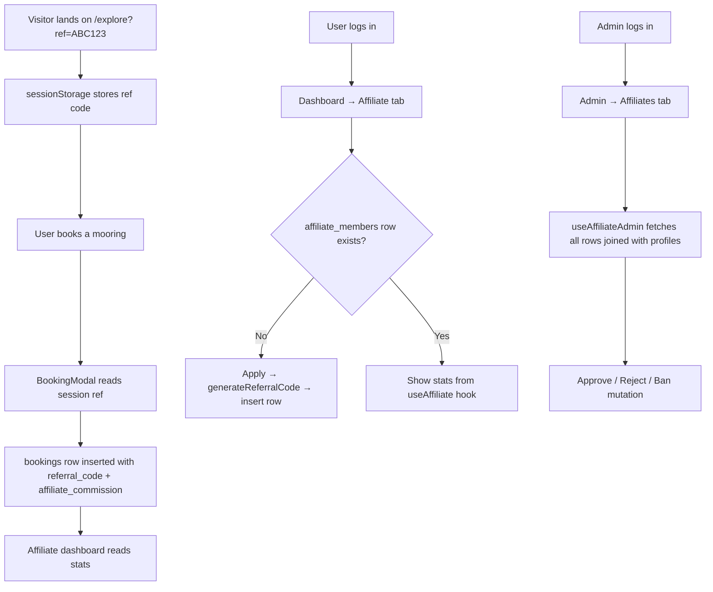

# Implementation Plan: Affiliate Program — Full Stack

> **Status:** Draft
> **Created:** 2026-02-28
> **Scope:** Build the complete affiliate/referral system — database layer, user registration flow, affiliate dashboard, admin management panel, and referral-code tracking on bookings.

---

## 🎯 Goal

Any logged-in user can apply to become an affiliate and receive a unique referral code + shareable link. When someone books a mooring via that link, the affiliate earns a commission. Admins can see all affiliates, approve/reject applications, and monitor payouts. This turns existing users into a low-cost growth channel.

---

## 📋 Requirements

### Functional
- [ ] Any authenticated user can apply to the affiliate program (one application per user)
- [ ] On application, a unique referral code is auto-generated (e.g. `A3B4XY72`)
- [ ] The affiliate receives a shareable link: `mooring-booking.com/explore?ref=A3B4XY72`
- [ ] When a visitor arrives via `?ref=CODE` and completes a booking, the booking is credited to that affiliate
- [ ] Affiliate dashboard tab shows: code, link, clicks, referred bookings, total commissions earned
- [ ] Admin panel tab shows all affiliates with name, code, status, stats; admin can approve / reject / ban
- [ ] Only approved affiliates earn commissions (pending affiliates can share their code but commissions are credited after approval)

### Non-Functional
- [ ] Referral code stored in `sessionStorage` (clears when tab closes — prevents stale attribution)
- [ ] RLS ensures each user can only read/write their own affiliate record; admin can read all
- [ ] Commission calculation happens at booking insertion time (simple client-side first; Edge Function later if needed)
- [ ] No new npm packages required

---

## 🗺️ Architecture Overview



**Affected existing files:**
- `src/pages/Dashboard.tsx` — add Affiliate tab
- `src/pages/Admin.tsx` — add Affiliates tab
- `src/pages/Explore.tsx` — capture `?ref=` param into sessionStorage
- Booking creation code (in `BookingModal.tsx` or booking hook) — attach `referral_code` field

**New files:**
- `src/lib/affiliateUtils.ts`
- `src/hooks/useAffiliate.ts`
- `src/hooks/useAffiliateAdmin.ts`
- `src/components/affiliate/AffiliateDashboard.tsx`
- `src/components/admin/AffiliateAdminTable.tsx`

---

## 📁 Files to Change

| File | Change Type | Summary |
|------|-------------|---------|
| Supabase migration | 🆕 Create | `affiliate_members` table + RLS + `referral_code` / `affiliate_commission` columns on `bookings` |
| `src/lib/affiliateUtils.ts` | 🆕 Create | `generateReferralCode()` + `buildReferralLink()` helpers |
| `src/hooks/useAffiliate.ts` | 🆕 Create | `useAffiliate`, `useApplyAffiliate`, `useAffiliateBookings` hooks |
| `src/hooks/useAffiliateAdmin.ts` | 🆕 Create | `useAllAffiliates`, `useUpdateAffiliateStatus` hooks |
| `src/components/affiliate/AffiliateDashboard.tsx` | 🆕 Create | User-facing affiliate tab UI (apply, stats, link, referred bookings) |
| `src/components/admin/AffiliateAdminTable.tsx` | 🆕 Create | Admin table: filterable list, approve/reject/ban actions |
| `src/pages/Dashboard.tsx` | ✏️ Modify | Add `'affiliate'` tab + render `<AffiliateDashboard />` |
| `src/pages/Admin.tsx` | ✏️ Modify | Add `'affiliates'` tab + render `<AffiliateAdminTable />` |
| `src/pages/Explore.tsx` | ✏️ Modify | `useEffect` to capture `?ref=` → `sessionStorage.setItem('referral_code', …)` |
| `BookingModal.tsx` (or booking hook) | ✏️ Modify | Read `sessionStorage.getItem('referral_code')`, attach to booking insert, clear after |

---

## 🧩 Implementation Steps

### Phase 1 — Database Foundation

- [ ] **Step 1.1** — Apply Supabase migration `create_affiliate_members`
  - Creates `affiliate_members` table with columns: `id`, `user_id`, `referral_code` (UNIQUE), `status` (pending/approved/rejected/banned), `commission_rate`, `total_clicks`, `total_referrals`, `total_earned`, `created_at`, `approved_at`, `notes`
  - Adds `referral_code TEXT` and `affiliate_commission NUMERIC` columns to `bookings`
  - Enables RLS; adds policies for self-read, self-insert, admin-all
  - Run via `mcp_supabase-mcp-server_apply_migration` with name `create_affiliate_members`

- [ ] **Step 1.2** — Verify RLS with `mcp_supabase-mcp-server_execute_sql`
  ```sql
  SELECT policyname, cmd, qual FROM pg_policies WHERE tablename = 'affiliate_members';
  ```
  - Run `mcp_supabase-mcp-server_get_advisors` (type: `security`) to confirm no gaps

### Phase 2 — Backend Logic (Hooks + Utils)

- [ ] **Step 2.1** — Create `src/lib/affiliateUtils.ts`
  - `generateReferralCode(userId)` → `string` (4 chars from userId + 4 random alphanum)
  - `buildReferralLink(code)` → full URL with `?ref=` param

- [ ] **Step 2.2** — Create `src/hooks/useAffiliate.ts`
  - `useAffiliate()` — TanStack Query fetch of `affiliate_members` row for current user
  - `useApplyAffiliate()` — mutation that inserts new row with generated code
  - `useAffiliateBookings(referralCode)` — query bookings with matching `referral_code`

- [ ] **Step 2.3** — Create `src/hooks/useAffiliateAdmin.ts`
  - `useAllAffiliates()` — fetches all rows joined with `profiles(full_name, email)`
  - `useUpdateAffiliateStatus()` — mutation to update `status` + `approved_at`

### Phase 3 — Referral Tracking on Bookings

- [ ] **Step 3.1** — Modify `src/pages/Explore.tsx`
  - Add `useEffect` that reads `window.location.search` for `?ref=CODE`
  - Stores code in `sessionStorage.setItem('referral_code', code)`

- [ ] **Step 3.2** — Modify booking creation (find the `supabase.from('bookings').insert(…)` call — likely in `BookingModal.tsx` or a booking hook)
  - Read `sessionStorage.getItem('referral_code') ?? null`
  - Add `referral_code` and `affiliate_commission` to the insert payload
  - Commission = `total_price × (affiliate.commission_rate / 100)` — use 10% default if code not looked up
  - Call `sessionStorage.removeItem('referral_code')` after successful insert

### Phase 4 — User-Facing Affiliate Dashboard

- [ ] **Step 4.1** — Create `src/components/affiliate/AffiliateDashboard.tsx`
  - **State: not applied** → Show "Apply" card with benefits + `<Button>` calling `useApplyAffiliate()`
  - **State: pending** → Show code + link (copy button) + "Waiting for approval" message
  - **State: approved** → KPI cards (code, clicks, referrals, total earned) + link copy + referred bookings table
  - **State: rejected/banned** → Status message + contact link

- [ ] **Step 4.2** — Modify `src/pages/Dashboard.tsx`
  - Add `'affiliate'` to tab union type
  - Add tab button "🔗 Affiliate" (visible to all logged-in users)
  - Render `<AffiliateDashboard />` when active

### Phase 5 — Admin Management Panel

- [ ] **Step 5.1** — Create `src/components/admin/AffiliateAdminTable.tsx`
  - Summary stats bar at top: total affiliates, pending, total commissions paid
  - Filter bar: status dropdown + search by name/code
  - Table: Name, Email, Code, Status badge, Clicks, Referrals, Earned, Applied date, Actions
  - Actions: **Approve** (green) / **Reject** (red) for pending; **Ban** for approved
  - Each action calls `useUpdateAffiliateStatus()` mutation

- [ ] **Step 5.2** — Modify `src/pages/Admin.tsx`
  - Add `'affiliates'` to the admin tabs
  - Add "Affiliates" tab button
  - Render `<AffiliateAdminTable />` when active

---

## ⚠️ Risks & Decisions

| # | Risk / Decision | Impact | Mitigation |
|---|----------------|--------|------------|
| 1 | `sessionStorage` attribution lost if user opens booking in new tab | Low-Medium | Acceptable tradeoff vs. long-term tracking cookies. Document this. |
| 2 | Admin RLS policy relies on `profiles.role = 'admin'` — if role column is missing, policy fails | High | Verify `profiles` table has `role` column before migration; add fallback if not |
| 3 | `total_clicks`, `total_referrals`, `total_earned` are NOT auto-updated by database triggers (managed client-side or via future RPC) | Medium | Phase 1 plan shows raw values from `bookings`; aggregate stats update manually or via a scheduled RPC in the future |
| 4 | Affiliate applies twice (duplicate insert) | Low | `referral_code` column has UNIQUE constraint; insert will fail gracefully; handle in mutation `onError` |
| 5 | Booking mutation location is uncertain — need to find the exact `supabase.from('bookings').insert` call | Medium | Grep codebase before Step 3.2 |

---

## 🔗 Dependencies & Prerequisites

- Supabase project ID: `bblxawscmyzelinidkmb`
- `profiles` table must have a `role` column (used for admin RLS policy)
- `bookings` table must be accessible (existing RLS policies already in place)
- No new npm packages needed — uses existing TanStack Query, shadcn/ui, Supabase client

---

## ✅ Verification Plan

### Automated
- [ ] `npm run build` in `Mooring Booking/` — no TypeScript errors after all files are created

### Manual (step-by-step)

**Test 1 — Referral code capture**
1. Open the app → navigate to `/explore?ref=TESTCODE` in the browser
2. Open browser DevTools → Application → Session Storage
3. ✅ Confirm `referral_code = TESTCODE` is stored

**Test 2 — Apply to affiliate program**
1. Log in as a regular user
2. Go to Dashboard → click "🔗 Affiliate" tab
3. Click "Apply" button
4. ✅ Confirm the new referral code and shareable link appear
5. ✅ In Supabase table editor, confirm a new row in `affiliate_members` with `status = 'pending'`

**Test 3 — Admin approve**
1. Log in as admin
2. Go to Admin panel → Affiliates tab
3. ✅ Confirm the pending application appears in the table
4. Click "Approve"
5. ✅ Confirm the row status changes to `approved`
6. ✅ Back in the user's affiliate tab: confirm stats are shown (code, link, KPI cards)

**Test 4 — Referral booking attribution**
1. Open a private/incognito window
2. Navigate to `/explore?ref=<your-test-code>` to set the session referral
3. Complete a booking as any user
4. ✅ In Supabase `bookings` table, confirm `referral_code = <your-test-code>` and `affiliate_commission > 0` for that booking
5. ✅ The affiliate's "Referred Bookings" table in their dashboard shows this booking

---

## 📝 Notes

- `total_clicks` counter is not implemented in Phase 1 — requires either a Supabase Edge Function increment call when the `/explore?ref=` page loads, or a separate `affiliate_clicks` table. Can be done as Phase 2 enhancement.
- Commission rate is `10%` default for all affiliates in Phase 1. Admin can later edit `commission_rate` per affiliate.
- The existing `src/pages/Affiliate.tsx` marketing page is NOT modified — it remains a public marketing page. The "Join Program" button there will eventually link to the Dashboard Affiliate tab after user logs in.
