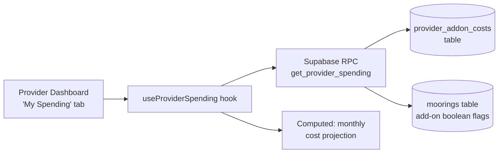

# Implementation Plan: Provider Marketing Spend Tracker

> **Status:** Draft  
> **Created:** 2026-02-28  
> **Scope:** New database table + backend tracking + frontend "My Spending" tab so every provider can see exactly how much they've spent on premium add-ons

---

## 🎯 Goal

Providers (mooring owners) currently have no visibility into what they've spent on premium add-ons. The add-on flags (`marketing_tools`, `insurance_mediation`, `is_now4today`, `is_premium_listing`) are already on the `moorings` table but there is **no payment history or cost ledger**. This plan creates a **`provider_addon_costs`** ledger table in Supabase and a **"💳 My Spending"** tab in the provider Dashboard that shows total spend, a breakdown by add-on type, and a per-mooring cost history.

---

## 📋 Requirements

### Functional
- [ ] Provider can see **total lifetime spend** on add-ons (all moorings combined)
- [ ] Provider can see **monthly recurring cost** running right now (active subscriptions × price)
- [ ] Provider can see **per add-on breakdown**: Marketing Tools €5/mo, Premium Listing €9.99/mo, Now4Today surcharge, Mooring Insurance €9.99/yr
- [ ] Provider can see a **chronological cost history** — when each add-on was activated/charged and for which mooring
- [ ] Read-only view — no payment buttons yet (Stripe is Phase 2D)
- [ ] Data is **per-mooring** so the provider can see which vez is costing the most

### Non-Functional
- [ ] RLS: provider sees **only their own records**
- [ ] Calculations are server-side (Supabase RPC) — no heavy client-side math
- [ ] TypeScript build must stay clean (0 errors)
- [ ] Works alongside the existing **💰 Earnings** tab without regressions

---

## 🗺️ Architecture Overview



### Add-On Pricing Reference (hardcoded on frontend)

| Add-On | Column on `moorings` | Price | Frequency |
|--------|---------------------|-------|-----------|
| Marketing Tools | `marketing_tools` | €5.00 | Monthly |
| Premium Listing | `is_premium_listing` | €9.99 | Monthly |
| Now4Today | `is_now4today` | +20% surcharge on bookings | Per booking |
| Mooring Insurance | `insurance_mediation` | €9.99 | Yearly |

---

## 📁 Files to Change

### Backend (Supabase)
| File / Migration | Change Type | Summary |
|-----------------|-------------|---------|
| Migration: `create_provider_addon_costs` | 🆕 Create | New `provider_addon_costs` table with RLS |
| Migration: `get_provider_spending_rpc` | 🆕 Create | RPC returning per-provider spend summary |
| Migration: `seed_addon_costs_from_moorings` | 🆕 Create | Backfill existing active add-ons as cost records |

### Frontend
| File | Change Type | Summary |
|------|-------------|---------|
| `src/hooks/useProviderSpending.ts` | 🆕 Create | React Query hook — fetches RPC + computes monthly projection |
| `src/components/provider/ProviderSpendingDashboard.tsx` | 🆕 Create | Full UI: summary cards, per-add-on breakdown, cost history table |
| `src/pages/Dashboard.tsx` | ✏️ Modify | Add "💳 My Spending" tab (provider-only, after Earnings) |

---

## 🧩 Implementation Steps

### Phase 1 — Database Foundation

- [ ] **Step 1.1** — Create `provider_addon_costs` table  
  ```sql
  CREATE TABLE provider_addon_costs (
    id            uuid PRIMARY KEY DEFAULT gen_random_uuid(),
    provider_id   uuid NOT NULL REFERENCES auth.users(id) ON DELETE CASCADE,
    mooring_id    uuid NOT NULL REFERENCES moorings(id) ON DELETE CASCADE,
    addon_type    text NOT NULL,      -- 'marketing_tools' | 'premium_listing' | 'now4today' | 'insurance'
    amount        numeric NOT NULL,   -- €5.00, €9.99, etc.
    billing_cycle text NOT NULL,      -- 'monthly' | 'yearly' | 'per_booking'
    activated_at  timestamptz NOT NULL DEFAULT now(),
    notes         text
  );
  ```
  Add RLS: `SELECT / INSERT / UPDATE WHERE provider_id = auth.uid()`
  
- [ ] **Step 1.2** — Create `get_provider_spending` RPC function  
  Returns:
  - `total_spent` — sum of all `provider_addon_costs.amount` for the provider
  - `monthly_recurring` — sum of monthly add-ons currently active
  - `yearly_recurring` — sum of yearly add-ons currently active
  - `by_addon[]` — grouped by `addon_type` with count, total amount
  - `by_mooring[]` — grouped by `mooring_id` with mooring name, total cost
  - `recent_costs[]` — last 20 rows ordered by `activated_at DESC`

- [ ] **Step 1.3** — Backfill seed data from existing moorings  
  For every mooring with `marketing_tools = true`: insert a cost record (€5/mo).  
  For every mooring with `is_premium_listing = true`: insert €9.99/mo.  
  For every mooring with `insurance_mediation = true`: insert €9.99/yr.  
  For every mooring with `is_now4today = true`: insert a symbolic €0 activation record (actual cost is per-booking surcharge, tracked separately).

- [ ] **Step 1.4** — Add a database trigger  
  When `moorings.marketing_tools` (or other add-on columns) changes from `false → true`, automatically insert a new `provider_addon_costs` record. This ensures future activations are tracked without manual inserts.

---

### Phase 2 — Frontend Hook

- [ ] **Step 2.1** — Create `src/hooks/useProviderSpending.ts`  
  - Calls `supabase.rpc('get_provider_spending', { p_provider_id: user.id })`
  - Exports types: `AddonCostRecord`, `AddonBreakdown`, `MooringCostBreakdown`, `ProviderSpendingSummary`
  - `queryKey: ['provider-spending', user?.id]`
  - `staleTime: 10 minutes`
  - Also returns `monthlyProjection` computed from active add-on flags × prices

---

### Phase 3 — UI Component

- [ ] **Step 3.1** — Create `ProviderSpendingDashboard.tsx`

  **Sections:**
  
  **A. Summary KPI Cards (3-column)**
  - 💳 Total Spent (all time)
  - 📅 Monthly Recurring (current active add-ons × price)
  - 📆 Next 12-month Projection
  
  **B. Active Add-ons Panel**  
  Table of currently active add-ons (from moorings with `= true`):
  | Add-On | Mooring | Price | Billing | Status |
  Highlight active ones with a green badge.
  
  **C. Per-Add-On Cost Breakdown**  
  List cards per add-on type showing:
  - Marketing Tools 📣 — total paid, X moorings active
  - Premium Listing ⭐ — total paid, X moorings active  
  - Now4Today 🔥 — activation records
  - Insurance 🛡️ — total paid, X moorings active
  
  **D. Cost History Table**  
  Chronological list of all cost records:
  | Date | Mooring | Add-On | Amount | Billing Cycle |

- [ ] **Step 3.2** — Add "💳 My Spending" tab in `Dashboard.tsx`  
  - Extend `activeTab` type: add `'spending'`
  - Add tab button after Earnings, before Settings
  - Add render branch

---

## ⚠️ Risks & Decisions

| # | Risk / Decision | Impact | Mitigation |
|---|----------------|--------|-----------|
| 1 | No real payment data yet (Stripe Phase 2D) | Medium | Use `provider_addon_costs` as a **manual/trigger-populated ledger** — when Stripe is added, it will insert into this same table via webhook |
| 2 | Now4Today cost is per-booking (20% surcharge), not a flat fee | Medium | Track activation record at €0; compute actual surcharge cost from `bookings.total_price × 0.20` where `is_now4today = true` — show this in the hook |
| 3 | Backfill trigger for existing moorings | Low | Step 1.3 seeds existing data; Step 1.4 covers future activations automatically |
| 4 | Provider may have moorings with no add-ons | Low | Show empty state "No add-ons activated yet" gracefully |

---

## 🔗 Dependencies & Prerequisites

- Supabase project: `bblxawscmyzelinidkmb`
- Existing tables: `moorings` (add-on boolean columns), `bookings` (for Now4Today surcharge calc)
- The Earnings tab (`ProviderEarningsDashboard`) must remain working — this is a new tab, no shared state
- No environment variables needed

---

## ✅ Verification Plan

### Automated
- [ ] `npx tsc --noEmit` → 0 errors
- [ ] SQL: verify `provider_addon_costs` table exists with correct RLS
- [ ] SQL: verify `get_provider_spending` RPC returns expected columns

### Manual (login as a provider)
- [ ] Navigate `/dashboard` → "💳 My Spending" tab appears
- [ ] Summary KPIs show non-zero values if any add-ons are active
- [ ] Per-add-on breakdown cards render correctly
- [ ] Cost history table shows backfilled records
- [ ] Toggle an add-on on `moorings` table → new cost record appears automatically (trigger test)

---

## 📝 Notes

- **Stripe Phase 2D**: When Stripe is implemented, payment webhooks will `INSERT INTO provider_addon_costs` automatically. The frontend hook and UI will work without any changes since they just read from this table.
- **Now4Today surcharge calculation**: The actual cost to the provider for Now4Today is `booking.total_price × 0.20 × 0` (it's actually a **surcharge on the guest**, not a cost to the provider). The plan is to show it as a "feature activation" record only, with a tooltip explaining the guest pays the surcharge.
- This plan aligns with the strategy in `BRAIN.md` Phase 2D for Stripe — the ledger table is designed to receive Stripe webhook data later.
